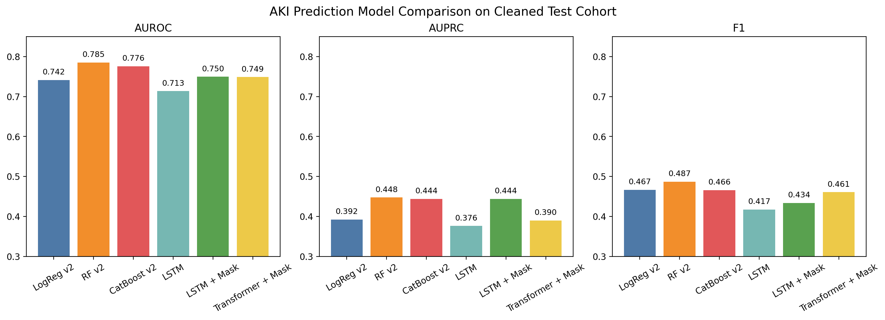
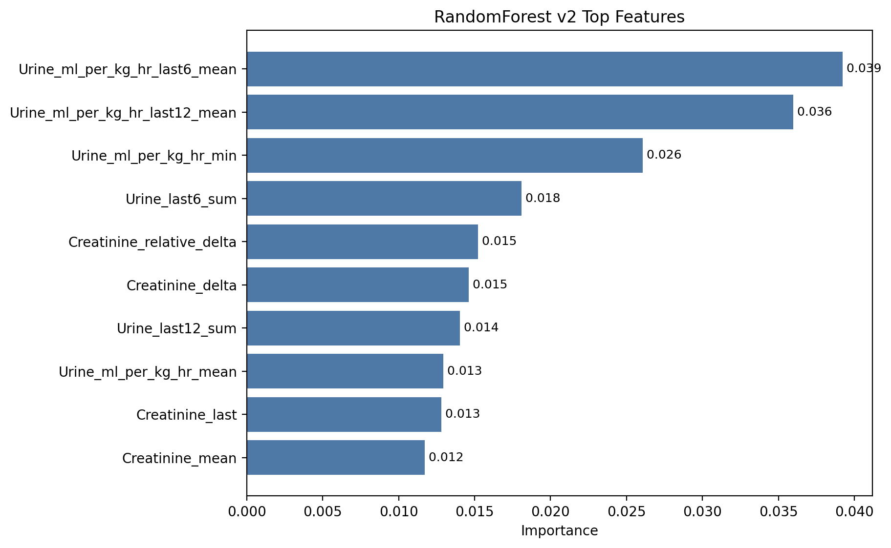
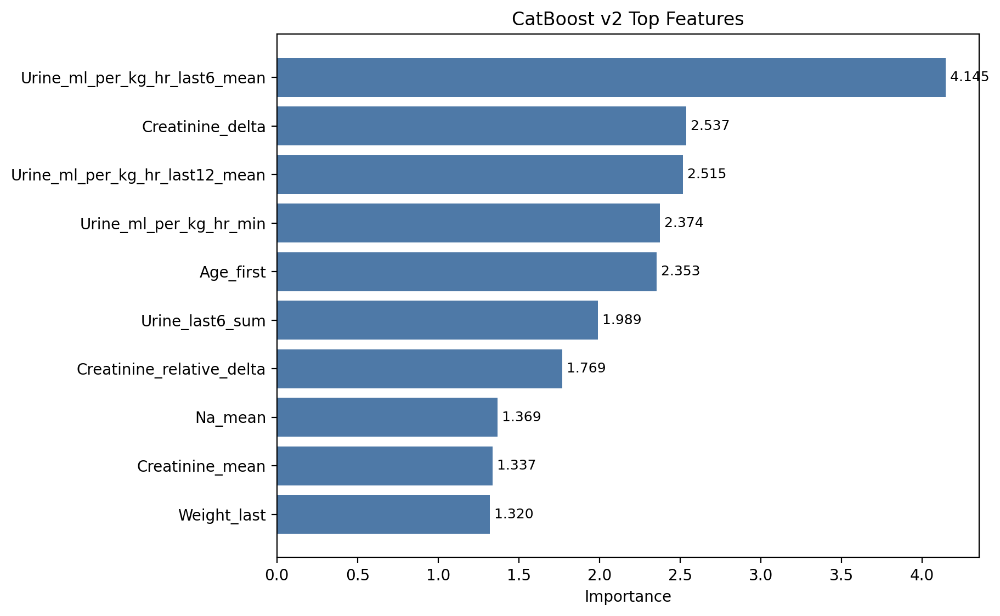
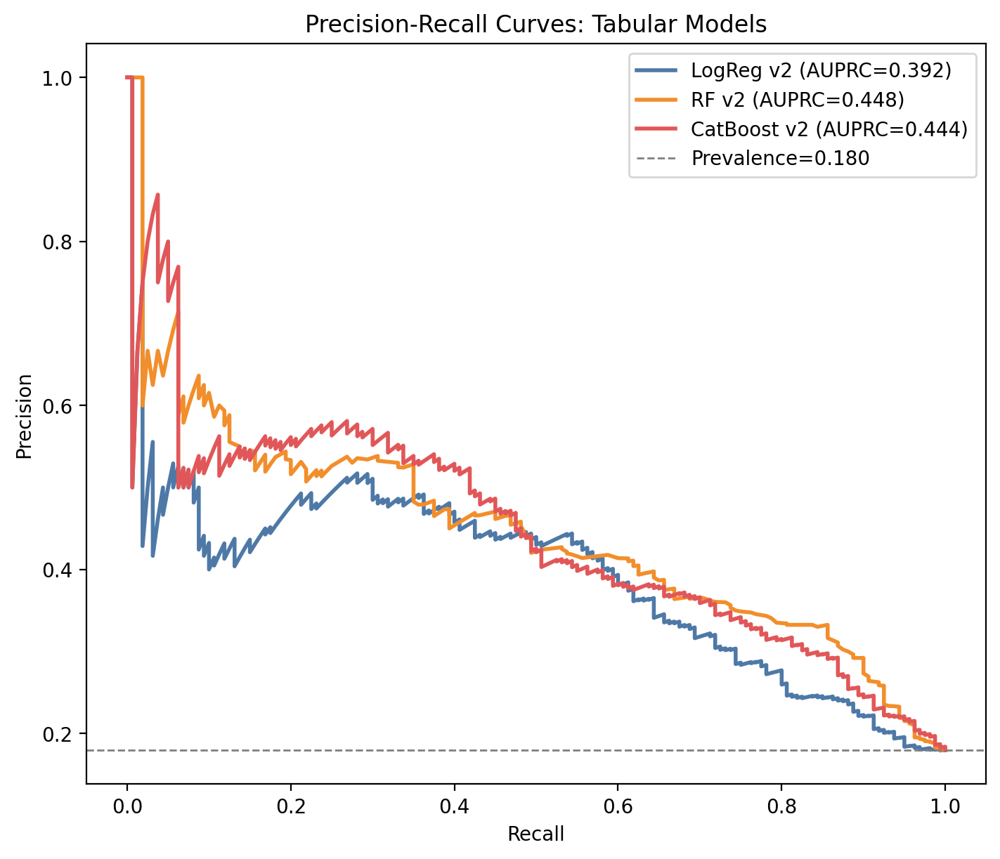
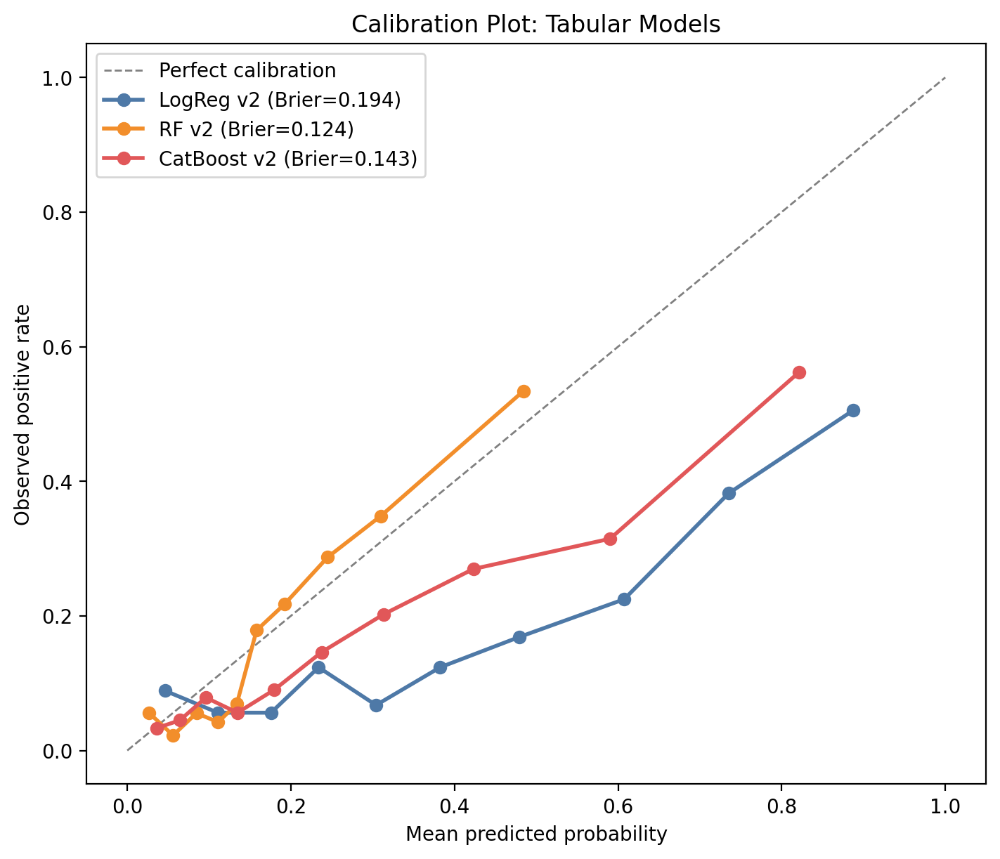
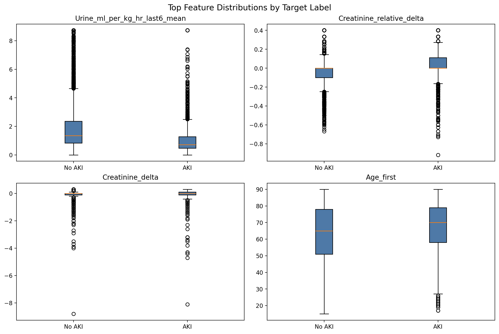
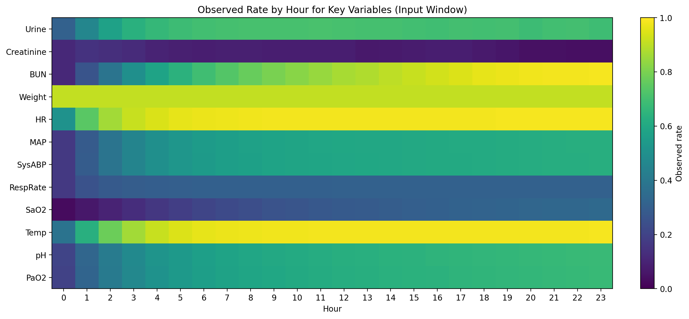
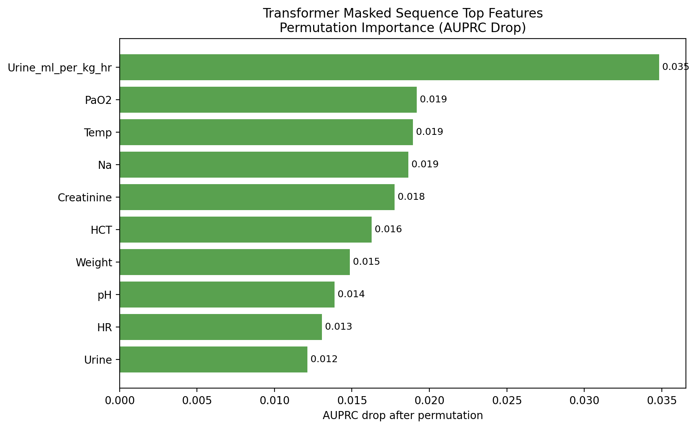

# AKI Prediction from ICU EMR

This repository organizes an ICU acute kidney injury (AKI) prediction project around a reproducible preprocessing and modeling pipeline.

The current goal is not "best possible score at any cost." The goal is:

1. define the cohort consistently,
2. preserve the provided split in `split_stay_id.json`,
3. make preprocessing explicit,
4. compare tabular and sequence baselines on the same cleaned cohort.

## Prediction Task

- Input window: hours `0-23`
- Prediction target: AKI event during hours `24-47`
- Split source: `split_stay_id.json`
- Early AKI stays: removed if AKI already appears during hours `0-23`

AKI labeling in this project uses:

- creatinine increase of at least `0.3` within the rolling 48 hour window
- urine output criterion based on `<= 0.5 mL/kg/hr` sustained for 6 hours

The raw data does not provide a reliable pre-ICU baseline creatinine, so the original KDIGO baseline-ratio criterion was not used here.

## Data Inputs

Expected files:

- `IMEN383_Team_Project_Files/released_df.csv.gz` or `released_df.csv`
- `IMEN383_Team_Project_Files/split_stay_id.json`

## Repository Layout

- `src/`
  - core preprocessing, feature, and sequence utilities
- `scripts/`
  - runnable entry points for preprocessing, EDA, tabular training, sequence training
- `reports/`
  - processed artifacts, metrics, EDA tables, feature importance outputs
- `docs/`
  - project notes and results summary
- `notebooks/`
  - archived and exploratory notebooks only
- `legacy/`
  - old notebook-era scripts, setup notes, and course materials kept for reference

## Current Cohort

Current cleaned cohort summary from [cohort_summary.json](C:/Users/USER/Desktop/대학교 자료/3-2학기/수업/헬스시스템엔지니어링/reports/processed/cohort_summary.json):

- filtered stays: `8963`
- removed early AKI stays: `2551`
- train: `7194` stays, `1376` positives
- valid: `878` stays, `168` positives
- test: `891` stays, `160` positives

## Preprocessing Decisions

### 1. Raw urine duplicate cleaning

For duplicated urine rows with the same `stay_id + charttime`:

- conflicting duplicates are resolved by keeping the smallest positive value
- hourly urine is then aggregated by `sum`

### 2. Hourly wide table

The raw event table is converted to an hourly wide table.

Aggregation rules:

- `Urine`: hourly `sum`
- `Creatinine`: hourly `min`
- other variables: hourly `last`

### 3. Broad plausibility cleaning

Clearly invalid values are set to `NaN`, not dropped row-wise.

Examples:

- impossible blood pressure values
- `Weight = 0`
- impossible `pH`
- extreme `Urine`

Cleaning stats are recorded in [cohort_summary.json](C:/Users/USER/Desktop/대학교 자료/3-2학기/수업/헬스시스템엔지니어링/reports/processed/cohort_summary.json).

### 4. Forward fill policy

After value cleaning:

- most variables are forward-filled within stay
- `Urine` and `Creatinine` are not forward-filled

### 5. Sequence observed mask

For sequence models, the project now also saves:

- [filtered_observed_mask.csv](C:/Users/USER/Desktop/대학교 자료/3-2학기/수업/헬스시스템엔지니어링/reports/processed/filtered_observed_mask.csv)

This preserves whether each hourly value was originally observed before forward fill.

## Processed Artifacts

Core processed outputs:

- [hourly_features.csv](C:/Users/USER/Desktop/대학교 자료/3-2학기/수업/헬스시스템엔지니어링/reports/processed/hourly_features.csv)
- [filtered_cohort.csv](C:/Users/USER/Desktop/대학교 자료/3-2학기/수업/헬스시스템엔지니어링/reports/processed/filtered_cohort.csv)
- [filtered_observed_mask.csv](C:/Users/USER/Desktop/대학교 자료/3-2학기/수업/헬스시스템엔지니어링/reports/processed/filtered_observed_mask.csv)
- [tabular_features_v1.csv](C:/Users/USER/Desktop/대학교 자료/3-2학기/수업/헬스시스템엔지니어링/reports/processed/tabular_features_v1.csv)
- [tabular_features_v2.csv](C:/Users/USER/Desktop/대학교 자료/3-2학기/수업/헬스시스템엔지니어링/reports/processed/tabular_features_v2.csv)
- [tabular_features_compact.csv](C:/Users/USER/Desktop/대학교 자료/3-2학기/수업/헬스시스템엔지니어링/reports/processed/tabular_features_compact.csv)

## EDA Outputs

EDA results are saved in [reports/eda](C:/Users/USER/Desktop/대학교 자료/3-2학기/수업/헬스시스템엔지니어링/reports/eda).

Useful files:

- [eda_summary.md](C:/Users/USER/Desktop/대학교 자료/3-2학기/수업/헬스시스템엔지니어링/reports/eda/eda_summary.md)
- [missingness_by_variable.csv](C:/Users/USER/Desktop/대학교 자료/3-2학기/수업/헬스시스템엔지니어링/reports/eda/missingness_by_variable.csv)
- [data_quality_flags.csv](C:/Users/USER/Desktop/대학교 자료/3-2학기/수업/헬스시스템엔지니어링/reports/eda/data_quality_flags.csv)

At the current stage, the main remaining EDA flag is near-zero variance for `MechVent`.

## Models Implemented

### Tabular models

The tabular models summarize hours `0-23` into one row per stay.

- Logistic Regression
- Random Forest
- CatBoost

### Sequence models

The sequence models use hourly `24 x F` inputs.

- value-only LSTM
- masked LSTM
- masked Transformer

For masked sequence models, each timestep contains:

- 43 scaled value features
- 43 observed-mask features

for a total of `86` timestep features.

Detailed model input summary:

- [model_inputs.md](C:/Users/USER/Desktop/대학교 자료/3-2학기/수업/헬스시스템엔지니어링/docs/model_inputs.md)
- [limitations_and_future_work.md](C:/Users/USER/Desktop/대학교 자료/3-2학기/수업/헬스시스템엔지니어링/docs/limitations_and_future_work.md)

## Current Results

See [docs/results_summary.md](C:/Users/USER/Desktop/대학교 자료/3-2학기/수업/헬스시스템엔지니어링/docs/results_summary.md) for the full comparison table.

Current practical takeaways:

- best tabular baseline: `RandomForest v2`
- best simple interpretable baseline: `Logistic Regression v2`
- best sequence baseline so far: `masked Transformer v1`
- adding mask information helps sequence models materially

## Key Figures

Pipeline overview:

- [pipeline_overview.md](docs/pipeline_overview.md)

Model comparison:



RandomForest top features:



CatBoost top features:



Tabular precision-recall curves:



Tabular calibration:



Top feature distributions:



Key variable missingness heatmap:



Masked Transformer permutation importance:



## How To Run

Install dependencies:

```bash
py -3 -m pip install -r requirements.txt
```

Run preprocessing:

```bash
py -3 scripts/01_preprocess.py
```

Run EDA:

```bash
py -3 scripts/00_eda.py
```

Build tabular features only:

```bash
py -3 scripts/02_train_tabular.py --feature-version v1 --rebuild-features --features-only
py -3 scripts/02_train_tabular.py --feature-version v2 --rebuild-features --features-only
```

Run tabular models:

```bash
py -3 scripts/02_train_tabular.py --model logistic --feature-version v2
py -3 scripts/02_train_tabular.py --model random_forest --feature-version v2
py -3 scripts/02_train_tabular.py --model catboost --feature-version v2
```

Run sequence models:

```bash
py -3 scripts/04_train_sequence.py
py -3 scripts/04_train_sequence.py --use-mask
py -3 scripts/05_train_transformer.py --use-mask
```

Run tuning:

```bash
py -3 scripts/02_train_tabular.py --model random_forest --feature-version v2 --tune-hyperparameters
py -3 scripts/02_train_tabular.py --model catboost --feature-version v2 --tune-hyperparameters
py -3 scripts/04_train_sequence.py --use-mask --tune-hyperparameters
py -3 scripts/05_train_transformer.py --use-mask --tune-hyperparameters
```

## Repository Notes

- Old notebooks are kept for reference, but the script-based pipeline is now the primary path.
- If `filtered_cohort.csv` is open in Excel or another viewer, preprocessing may fail when trying to overwrite it.
- The repository is not fully cleaned for publication yet, but the core training and reporting path is now script-driven and reproducible.
