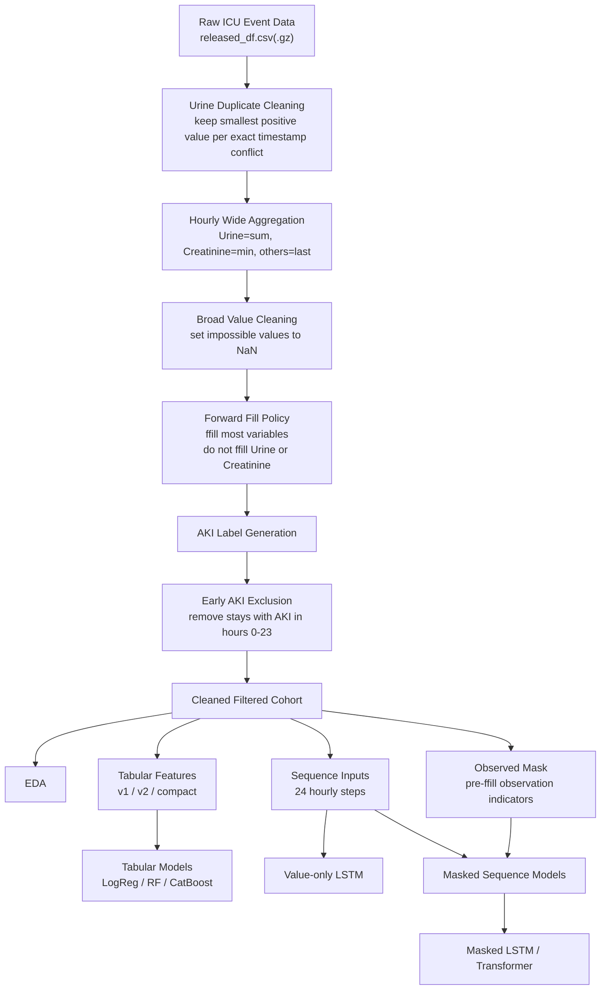

# Pipeline Overview

## Current Canonical Workflow

1. run preprocessing
2. run EDA
3. build tabular or sequence inputs from the same cleaned cohort
4. train baselines using the provided split
5. select threshold on validation data
6. report final test metrics
